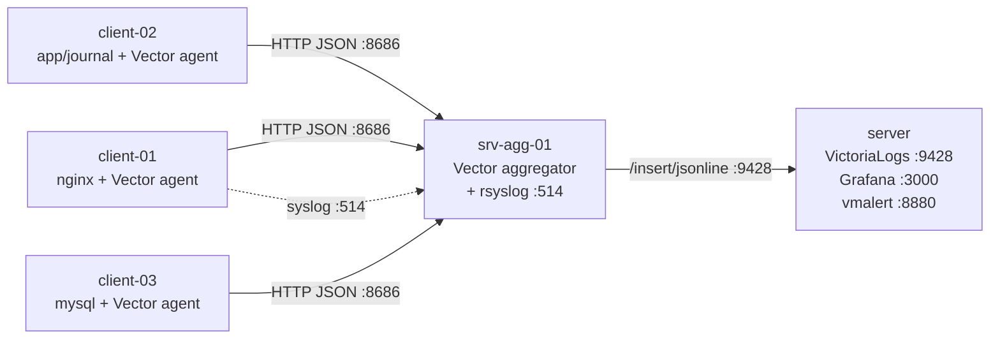

# PoC VictoriaLogs cho 5 server — Hướng dẫn build từng bước

> Triển khai thử nghiệm log tập trung dùng **VictoriaLogs single-node + Vector aggregator + Vector agent**, áp dụng KISS-YAGNI-DRY.
> Mục tiêu: 1–2 ngày dựng xong, có dashboard Grafana hoạt động, đủ cơ sở để mở rộng 200 server.

---

## 0. Tổng quan PoC

### Topology



### Bảng máy

| Hostname | Role | vCPU | RAM | Disk | OS |
|---|---|---|---|---|---|
| `server` | VL + Grafana + vmalert | 4 | 8 GB | 100 GB SSD | Ubuntu 22.04 |
| `srv-agg-01` | Vector aggregator + rsyslog | 2 | 4 GB | 30 GB | Ubuntu 22.04 |
| `client-01` | nginx (sample web) | 2 | 2 GB | 20 GB | Ubuntu 22.04 |
| `client-02` | app sample + journald | 2 | 2 GB | 20 GB | Ubuntu 22.04 |
| `client-03` | mysql (slow log) | 2 | 4 GB | 30 GB | Ubuntu 22.04 |

### Cổng dùng

| Cổng | Service | Trên máy |
|---|---|---|
| 9428 | VL HTTP API | server |
| 3000 | Grafana | server |
| 8880 | vmalert | server |
| 8686 | Vector aggregator HTTP source | srv-agg-01 |
| 514/udp,tcp | rsyslog | srv-agg-01 |
| 8686 (lo) | Vector agent API local | client-* |

---

## 1. Chuẩn bị (tất cả server)

```bash
# Đồng bộ giờ - rất quan trọng cho log
sudo timedatectl set-timezone Asia/Ho_Chi_Minh
sudo apt update && sudo apt -y install chrony curl wget gnupg ca-certificates
sudo systemctl enable --now chrony

# Thêm /etc/hosts để 5 máy gọi nhau bằng tên (nếu chưa có DNS)
cat <<EOF | sudo tee -a /etc/hosts
10.0.0.10  server
10.0.0.11  srv-agg-01
10.0.0.21  client-01
10.0.0.22  client-02
10.0.0.23  client-03
EOF
```

Mở firewall (ufw mẫu):

```bash
# server
sudo ufw allow from 10.0.0.0/24 to any port 9428,3000,8880 proto tcp

# srv-agg-01
sudo ufw allow from 10.0.0.0/24 to any port 8686 proto tcp
sudo ufw allow from 10.0.0.0/24 to any port 514 proto tcp
sudo ufw allow from 10.0.0.0/24 to any port 514 proto udp
```

---

## 2. Cài VictoriaLogs trên `server`

### 2.1. Tải binary

```bash
VL_VER="v1.40.0"   # kiểm tra release mới: https://github.com/VictoriaMetrics/VictoriaLogs/releases
cd /tmp
wget https://github.com/VictoriaMetrics/VictoriaLogs/releases/download/${VL_VER}/victoria-logs-linux-amd64-${VL_VER}.tar.gz
tar xzf victoria-logs-linux-amd64-*.tar.gz
sudo mv victoria-logs-prod /usr/local/bin/victoria-logs
sudo chmod +x /usr/local/bin/victoria-logs

sudo useradd -rs /bin/false victorialogs
sudo mkdir -p /var/lib/victoria-logs
sudo chown -R victorialogs:victorialogs /var/lib/victoria-logs
```

### 2.2. Systemd unit

`/etc/systemd/system/victoria-logs.service`:

```ini
[Unit]
Description=VictoriaLogs
After=network.target

[Service]
User=victorialogs
Group=victorialogs
ExecStart=/usr/local/bin/victoria-logs \
  -storageDataPath=/var/lib/victoria-logs \
  -httpListenAddr=:9428 \
  -retentionPeriod=7d \
  -retention.maxDiskSpaceUsageBytes=50GiB \
  -loggerTimezone=Asia/Ho_Chi_Minh
Restart=always
LimitNOFILE=1048576

[Install]
WantedBy=multi-user.target
```

```bash
sudo systemctl daemon-reload
sudo systemctl enable --now victoria-logs
sudo systemctl status victoria-logs --no-pager
curl -s http://localhost:9428/health   # → OK
```

Truy cập vmui: `http://server:9428/select/vmui/`

---

## 3. Cài Grafana trên `server`

```bash
sudo mkdir -p /etc/apt/keyrings
wget -qO- https://apt.grafana.com/gpg.key | gpg --dearmor | sudo tee /etc/apt/keyrings/grafana.gpg >/dev/null
echo "deb [signed-by=/etc/apt/keyrings/grafana.gpg] https://apt.grafana.com stable main" | sudo tee /etc/apt/sources.list.d/grafana.list
sudo apt update && sudo apt -y install grafana

# Cài plugin VictoriaLogs datasource
sudo grafana-cli plugins install victoriametrics-logs-datasource
sudo systemctl enable --now grafana-server
```

Mở `http://server:3000` (admin/admin → đổi pass).

**Add datasource:**
- Type: **VictoriaLogs**
- URL: `http://localhost:9428`
- Save & Test.

---

## 4. Cài Vector aggregator trên `srv-agg-01`

### 4.1. Cài Vector

```bash
curl -1sLf https://repositories.timber.io/public/vector/setup.deb.sh | sudo -E bash
sudo apt -y install vector
sudo mkdir -p /var/lib/vector/buffer
sudo chown -R vector:vector /var/lib/vector
```

### 4.2. Config `/etc/vector/vector.yaml`

```yaml
data_dir: /var/lib/vector

sources:
  # Nhận log JSON từ Vector agent (HTTP)
  agents_http:
    type: http_server
    address: 0.0.0.0:8686
    encoding: ndjson
    path: /ingest

  # Nhận syslog từ network device / rsyslog upstream
  syslog_in:
    type: syslog
    address: 0.0.0.0:5140       # rsyslog forward về đây
    mode: tcp

transforms:
  enrich:
    type: remap
    inputs: [agents_http, syslog_in]
    source: |
      .ingested_at = now()
      .pop_env = .env || "prod"
      # mask password=, token= (PII)
      .message = string!(.message)
      .message = replace(.message, r'password=\S+', "password=***")
      .message = replace(.message, r'token=\S+', "token=***")

sinks:
  to_vl:
    type: http
    inputs: [enrich]
    uri: http://server:9428/insert/jsonline?_stream_fields=host,env,service,log_type&_time_field=timestamp&_msg_field=message
    method: post
    encoding:
      codec: json
    framing:
      method: newline_delimited
    compression: gzip
    buffer:
      type: disk
      max_size: 10737418240   # 10 GB
      when_full: block
    healthcheck:
      enabled: false
```

```bash
sudo systemctl enable --now vector
sudo systemctl status vector --no-pager
sudo journalctl -u vector -f
```

### 4.3. rsyslog relay (cho network device → forward sang Vector :5140)

`/etc/rsyslog.d/60-relay.conf`:

```conf
module(load="imudp") input(type="imudp" port="514")
module(load="imtcp") input(type="imtcp" port="514")

# Forward tất cả sang Vector
*.* @@127.0.0.1:5140
```

```bash
sudo systemctl restart rsyslog
```

---

## 5. Cài Vector agent trên `client-01/02/03`

### 5.1. Cài Vector (giống mục 4.1)

### 5.2. Config mẫu cho `client-01` (nginx) — **parse raw → JSON**

Nguyên tắc: agent **parse log raw → structured JSON** ngay tại client, trước khi gửi đi. Lợi ích:
- Query LogsQL theo field cụ thể (`status:500`, `request_time:>1s`) thay vì grep text.
- Giảm tải cho aggregator/VL (không phải parse lại).
- Field rõ ràng → dashboard Grafana dựng nhanh.

`/etc/vector/vector.yaml`:

```yaml
data_dir: /var/lib/vector

sources:
  nginx_access:
    type: file
    include: ["/var/log/nginx/access.log"]
    read_from: end

  nginx_error:
    type: file
    include: ["/var/log/nginx/error.log"]
    read_from: end

  journal:
    type: journald
    current_boot_only: true

transforms:
  # ---- NGINX ACCESS: parse combined log format → JSON ----
  parse_nginx_access:
    type: remap
    inputs: [nginx_access]
    source: |
      raw = string!(.message)
      parsed, err = parse_nginx_log(raw, "combined")
      if err == null {
        . = merge!(., parsed)
        .parse_ok = true
      } else {
        .parse_ok = false
        .parse_err = err
      }
      .host = "client-01"
      .env = "poc"
      .service = "nginx"
      .log_type = "access"
      .datacenter = "hn"
      .timestamp = now()
      # ép kiểu cho field số (LogsQL filter chính xác hơn)
      if exists(.status)        { .status = to_int(.status) ?? 0 }
      if exists(.body_bytes_sent) { .bytes = to_int(.body_bytes_sent) ?? 0 }
      del(.body_bytes_sent)

  # ---- NGINX ERROR: parse format "YYYY/MM/DD HH:MM:SS [level] pid#tid: ..." ----
  parse_nginx_error:
    type: remap
    inputs: [nginx_error]
    source: |
      raw = string!(.message)
      parsed, err = parse_regex(raw, r'^(?P<ts>\d{4}/\d{2}/\d{2} \d{2}:\d{2}:\d{2}) \[(?P<level>\w+)\] (?P<pid>\d+)#(?P<tid>\d+): (?P<msg>.*)$')
      if err == null {
        .level = parsed.level
        .pid   = to_int(parsed.pid) ?? 0
        .message = parsed.msg
        .parse_ok = true
      } else {
        .parse_ok = false
      }
      .host = "client-01"
      .env = "poc"
      .service = "nginx"
      .log_type = "error"
      .datacenter = "hn"
      .timestamp = now()

  # ---- JOURNALD: đã structured sẵn, chỉ chuẩn hoá field ----
  parse_journal:
    type: remap
    inputs: [journal]
    source: |
      .host = "client-01"
      .env = "poc"
      .service = string!(.SYSTEMD_UNIT) || "systemd"
      .log_type = "syslog"
      .datacenter = "hn"
      .message = string!(.message)
      .priority = to_int(.PRIORITY) ?? 6
      # giữ lại các field journald hữu ích, bỏ field nhiễu
      del(._SOURCE_REALTIME_TIMESTAMP)
      del(.__CURSOR)
      del(.__MONOTONIC_TIMESTAMP)
      .timestamp = now()

sinks:
  to_agg:
    type: http
    inputs: [parse_nginx_access, parse_nginx_error, parse_journal]
    uri: http://srv-agg-01:8686/ingest
    method: post
    encoding:
      codec: json
    framing:
      method: newline_delimited
    compression: gzip
    buffer:
      type: disk
      max_size: 1073741824   # 1 GB
      when_full: block
```

**Ví dụ output sau parse (nginx access):**

```json
{
  "timestamp": "2026-06-19T09:10:23+07:00",
  "host": "client-01",
  "env": "poc",
  "service": "nginx",
  "log_type": "access",
  "client": "10.0.0.5",
  "method": "GET",
  "path": "/api/users",
  "status": 200,
  "bytes": 1248,
  "referer": "-",
  "agent": "curl/8.4.0",
  "parse_ok": true
}
```

→ Query LogsQL: `_time:5m service:nginx status:>=500 | stats by(path) count()`

Cho phép Vector đọc nginx log:

```bash
sudo usermod -aG adm vector
sudo systemctl restart vector
```

### 5.3. Variant cho `client-02` (app sample + journal) — parse JSON app log

App nếu log dạng JSON line (khuyến nghị): chỉ cần `parse_json`. Nếu log text: dùng `parse_regex` hoặc `parse_grok`.

```yaml
sources:
  app_log:
    type: file
    include: ["/var/log/app/*.log"]
    read_from: end

transforms:
  parse_app:
    type: remap
    inputs: [app_log]
    source: |
      raw = string!(.message)
      parsed, err = parse_json(raw)
      if err == null && is_object(parsed) {
        . = merge!(., object!(parsed))
        .parse_ok = true
      } else {
        # fallback: log text thường, giữ nguyên message
        .parse_ok = false
      }
      .host = "client-02"
      .env  = "poc"
      .service  = "app"
      .log_type = "app"
      .datacenter = "hn"
      .timestamp = now()
      # chuẩn hoá level về lowercase
      if exists(.level) { .level = downcase(string!(.level)) }
```

Journal vẫn dùng transform `parse_journal` ở mục 5.2 (đổi `.host = "client-02"`).

### 5.4. Variant cho `client-03` (mysql slow log) — parse multiline → JSON

```yaml
sources:
  mysql_slow:
    type: file
    include: ["/var/log/mysql/mysql-slow.log"]
    multiline:
      start_pattern: '^# Time:'
      mode: halt_before
      condition_pattern: '^# Time:'
      timeout_ms: 1000

transforms:
  parse_mysql_slow:
    type: remap
    inputs: [mysql_slow]
    source: |
      raw = string!(.message)
      parsed, err = parse_regex(raw, r'(?ms)^# Time:\s*(?P<ts>\S+).*?^# User@Host:\s*(?P<user>\S+)\s*\[\S+\]\s*@\s*(?P<client_host>\S+).*?^# Query_time:\s*(?P<query_time>[\d.]+)\s+Lock_time:\s*(?P<lock_time>[\d.]+)\s+Rows_sent:\s*(?P<rows_sent>\d+)\s+Rows_examined:\s*(?P<rows_examined>\d+).*?(?P<query>SELECT|INSERT|UPDATE|DELETE|WITH)[\s\S]*$')
      if err == null {
        .user          = parsed.user
        .client_host   = parsed.client_host
        .query_time    = to_float(parsed.query_time) ?? 0.0
        .lock_time     = to_float(parsed.lock_time) ?? 0.0
        .rows_sent     = to_int(parsed.rows_sent) ?? 0
        .rows_examined = to_int(parsed.rows_examined) ?? 0
        .query         = parsed.query
        .parse_ok      = true
      } else {
        .parse_ok = false
      }
      .host = "client-03"
      .env  = "poc"
      .service  = "mysql"
      .log_type = "slow_query"
      .datacenter = "hn"
      .timestamp = now()
```

→ Query: `_time:1h service:mysql query_time:>2 | stats by(user) count()`

Bật slow log MySQL:

```sql
SET GLOBAL slow_query_log = 'ON';
SET GLOBAL long_query_time = 1;
SET GLOBAL slow_query_log_file = '/var/log/mysql/mysql-slow.log';
```

---

## 6. Kiểm tra ingest

### 6.1. Smoke test thủ công (chạy ở `srv-agg-01`)

```bash
echo '{"timestamp":"'$(date -Iseconds)'","host":"test","env":"poc","service":"manual","log_type":"test","message":"hello vl"}' \
  | curl -X POST -H "Content-Type: application/x-ndjson" --data-binary @- \
    http://server:9428/insert/jsonline?_stream_fields=host,env,service,log_type&_time_field=timestamp&_msg_field=message
```

### 6.2. Query qua vmui

Mở `http://server:9428/select/vmui/`, gõ:

```logsql
_time:5m service:manual
_time:15m host:client-01 service:nginx
_time:1h env:poc | stats by(service) count() as n
```

### 6.3. Sinh tải log thử

Trên `client-01`:

```bash
sudo apt -y install nginx
for i in $(seq 1 200); do curl -s http://localhost/ >/dev/null; done
# 200 sẽ thấy ngay trong nginx access.log
```

---

## 7. Dashboard Grafana tối thiểu

Tạo dashboard **PoC Fleet Overview**, 4 panel:

| Panel | Query LogsQL |
|---|---|
| Logs/s | `_time:5m env:poc | stats by(_time:1m) count() as logs_per_min` |
| Top services | `_time:1h env:poc | stats by(service) count() as n | sort by(n) desc | limit 10` |
| Errors (nginx) | `_time:1h service:nginx log_type:error` (table) |
| Live tail | `_time:5m env:poc` (live mode bật) |

Variables: `env`, `host`, `service` (dạng query từ field `_stream`).

---

## 8. Alert thử nghiệm (vmalert)

### 8.1. Cài vmalert

```bash
VM_VER="v1.115.0"
wget https://github.com/VictoriaMetrics/VictoriaMetrics/releases/download/${VM_VER}/vmutils-linux-amd64-${VM_VER}.tar.gz
tar xzf vmutils-*.tar.gz
sudo mv vmalert-prod /usr/local/bin/vmalert
```

`/etc/vmalert/rules.yml`:

```yaml
groups:
  - name: poc-log-alerts
    interval: 1m
    rules:
      - alert: NginxErrorBurst
        expr: |
          _time:5m service:"nginx" log_type:"error" | stats count() as errors
        for: 1m
        labels: { severity: warning }
        annotations:
          summary: "Nginx errors > threshold trên fleet PoC"
```

Systemd `/etc/systemd/system/vmalert.service`:

```ini
[Unit]
Description=vmalert
After=network.target

[Service]
ExecStart=/usr/local/bin/vmalert \
  -datasource.url=http://localhost:9428 \
  -rule=/etc/vmalert/rules.yml \
  -notifier.url=http://localhost:9093 \
  -httpListenAddr=:8880 \
  -rule.defaultRuleType=vlogs
Restart=always

[Install]
WantedBy=multi-user.target
```

```bash
sudo systemctl daemon-reload
sudo systemctl enable --now vmalert
```

> PoC có thể bỏ Alertmanager, chỉ xem rule trạng thái tại `http://server:8880`.

---

## 9. Validation checklist

- [ ] `curl http://server:9428/health` → OK
- [ ] Vector agent log: `journalctl -u vector` không lỗi `connection refused`
- [ ] vmui query `_time:5m` ra log từ cả 3 server app
- [ ] Disk `/var/lib/victoria-logs` tăng dần (vài MB sau 10 phút)
- [ ] Grafana panel "Logs/s" có đường biểu đồ
- [ ] Tắt VL 2 phút → bật lại → log không mất (Vector buffer)
- [ ] Restart Vector aggregator → agent tự reconnect
- [ ] Stream cardinality OK: `curl 'http://server:9428/select/logsql/streams?query=*'` < 20 streams

---

## 10. Bẫy thường gặp

| Triệu chứng | Nguyên nhân | Fix |
|---|---|---|
| `400 Bad Request` khi insert | Thiếu `_time_field`/`_msg_field` query param | Bổ sung đúng key trong URL sink |
| Stream nổ (1000+ streams) | Đặt `request_id`, `trace_id` làm `_stream_fields` | Chỉ giữ host/env/service/log_type |
| Vector không đọc được file | Quyền /var/log | `usermod -aG adm vector` + restart |
| Timestamp lệch | Quên chrony / timezone | Mục 1, bắt buộc đồng bộ |
| Disk full nhanh | DEBUG mở nhầm | Giảm log level + giảm `retentionPeriod` |
| Grafana không thấy datasource | Plugin chưa cài | `grafana-cli plugins install victoriametrics-logs-datasource` |

---

## 11. Lộ trình 2 ngày

| Ngày | Buổi | Việc |
|---|---|---|
| D1 sáng | | Mục 1–3: chuẩn bị, cài VL, Grafana |
| D1 chiều | | Mục 4–5: aggregator + agent, ingest test |
| D2 sáng | | Mục 6–7: query LogsQL, dựng dashboard |
| D2 chiều | | Mục 8–9: alert + validation + bàn giao |

---

## 12. Bước tiếp theo sau PoC

1. **Bench tải thật**: bắn 5–10k log/s trong 30 phút → đo CPU/disk VL.
2. **Bổ sung TLS + basic auth** giữa agent ↔ aggregator ↔ VL (Nginx reverse proxy trước :9428).
3. **Mask PII đầy đủ**: thêm regex card number, email khi cần.
4. **Mở rộng 50 server**: Ansible playbook đẩy config Vector theo template (chỉ thay `host:` và file path).
5. **Quyết định cluster**: nếu PoC cho thấy > 200 GB/ngày khi nhân lên 200 server → planning Option B (vlinsert/vlstorage/vlselect).

---

## 13. Câu hỏi còn mở

1. PoC chạy trên VM nội bộ hay cloud (AWS/GCP)? → ảnh hưởng phần `ufw`/security group.
2. Có sẵn Grafana production muốn tái dùng, hay deploy mới trên `server`?
3. Có cần TLS ngay ở PoC (môi trường có yêu cầu compliance)?
4. Có network device (switch/firewall) muốn test syslog ngay PoC không?
5. Đã có Ansible/SaltStack để rollout agent chưa, hay sẽ cài tay 3 máy?
